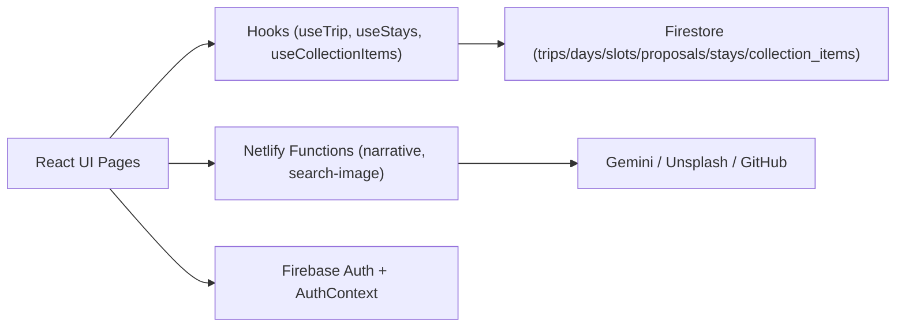

# Feb 28 Productionizing

## High-level context

- **What this app is**  
  - A collaborative trip-planning tool where groups create trips, brainstorm ideas, vote/lock plans, and view a narrative-style itinerary and collection of ideas.

- **Tech stack**  
  - **Frontend**: Vite + React + TypeScript + Tailwind + Framer Motion.  
  - **Auth & data**: Firebase Auth + Firestore (collections for `trips`, `days`, `slots`, `proposals`, `stays`, `collection_items`, etc.).  
  - **Serverless**: Netlify Functions for Gemini narrative generation and Unsplash image search, using Firebase Admin to verify ID tokens.

- **Routing & main flows**  
  - Landing / home show “My trips”; trips are defined in the `trips` collection.  
  - `/trip/:slug` → planning board (days/slots/proposals), powered by `useTrip`.  
  - `/trip/:slug/itinerary` → narrative itinerary view (hero, vibes, daily sections, stays, etc.).  
  - `/trip/:slug/collection` → collection of ideas and AI suggestions.  
  - Stays are managed via a bottom drawer UI, backed by a `stays` collection.

- **Current roles & permissions (already implemented)**  
  - `useTrip` exposes **`isMember`** and **`isOwner`** based on `trip.member_uids` and `trip.owner_uid`.  
  - Non-members can view trips via a link but see a **read-only** UI:
    - `TripPage` shows a banner explaining they’re guests and prompting them to join.  
    - Planning actions (add/edit/delete slots/proposals, lock/unlock, pick from collection) are hidden or disabled for non-members.  
    - Only the **owner** can delete entire slots from the planning board.  
    - `StaysDrawer` only allows adding/deleting stays for members.  
    - `CollectionPage` only allows members to add ideas, like, or edit/delete; owners or creators can edit/delete.  
    - `ItineraryPage` only allows members to change the hero photo or generate/update AI narrative text.

- **What we are deferring for now**  
  - Moving secrets (GitHub PAT, Gemini key) fully server-side and auditing env usage will be done in a later phase, not immediately.

---

## Trip Collab Production Hardening Plan

### Progress (updated Feb 27, 2026)

- ✅ `src/services/staysService.ts` created and wired into `src/hooks/useStays.ts`.
- ✅ `src/services/collectionService.ts` created and wired into `src/hooks/useCollectionItems.ts`.

### Overview

This plan captures the remaining work to bring the trip-collab app to production quality, building on the UI permission changes already implemented. It focuses on centralizing data access, fixing Firestore scaling edges, improving UX around async work and AI, cleaning up schemas, and adding tests and stricter typing.

### Current high-level architecture (for reference)

You’ve already wired `isMember` / `isOwner` through `useTrip` and gated UI actions in `TripPage`, `PlanningBoard`, `ProposalDrawer`, `TripSetupPanel`, `StaysDrawer`, `CollectionPage`, and `ItineraryPage`.

---

### 1. Firestore service/data layer

- **Create services directory**
  - Add `src/services/` with modules such as:
    - `src/services/tripService.ts` – load trip by `slug` / `id`, list user trips, join trip, update trip meta.
    - `src/services/planningService.ts` – CRUD for `days`, `slots`, `proposals`, slot locking/unlocking, voting.
    - `src/services/staysService.ts` – CRUD for `stays` scoped by `trip_id`.
    - `src/services/collectionService.ts` – CRUD for `collection_items`, likes, AI-suggested inserts.
  - Each service should:
    - Use the shared types in `src/types/database.ts`.
    - Return typed objects (`Trip`, `DayWithSlots`, `Stay`, `CollectionItem`, etc.) rather than raw Firestore snapshots.
    - Encapsulate invariants (e.g. `trip_id` / `day_id` presence, slot status transitions, safe deletes).

- **Refactor components/hooks to use services**
  - Update hooks:
    - `src/hooks/useTrip.ts` to call `tripService` / `planningService` for queries and subscriptions.
    - `src/hooks/useStays.ts` to call `staysService`.
    - `src/hooks/useCollectionItems.ts` to call `collectionService`.
  - Update write-heavy components to delegate to services instead of calling Firestore directly:
    - **Planning**: `src/components/planning/DayColumn.tsx`, `ProposalDrawer.tsx`, `TripSetupPanel.tsx`.
    - **Stays**: `src/components/stays/StaysDrawer.tsx`.
    - **Collection**: `src/pages/CollectionPage.tsx`, `src/components/collection/CollectionItemForm.tsx`.

---

### 2. `useTrip` query & subscription hardening

- **Remove the `in`-query day limit risk**
  - In `src/hooks/useTrip.ts`, replace `where('day_id', 'in', dayIds)` with one of:
    - Chunked `in` queries (batches of ≤ 10 `day_id`s merged in memory), or
    - A data layout change (e.g. `trips/{tripId}/slots` subcollection) so you can query by `trip_id` instead.

- **Extract subscription wiring**
  - Move the multi-snapshot composition (`trips`, `days`, `slots`, `proposals`, `ensureLegacyLockedProposals`) into a focused helper, e.g. `src/services/tripSubscription.ts` or an internal hook.
  - Keep `useTrip` as a thin hook that calls this helper and exposes `{ trip, days, travelers, loading, error, isMember, isOwner }`.
  - Ensure error states distinguish between “auth/permission”, “not found”, and generic errors so the UI can show tailored messages.

---

### 3. Async UX & component decomposition

- **Break large pages into smaller components**
  - `src/pages/ItineraryPage.tsx`:
    - Extract subcomponents such as `ItineraryHero`, `ItineraryCustomizePanel`, `ItineraryVibeSection`, `ItineraryDaysList`, `UpdateTextModal` into `src/components/itinerary/`.
    - Keep the page-level file focused on data fetching, scroll behavior, and wiring.
  - `src/pages/CollectionPage.tsx`:
    - Extract `CollectionHeader`, `CollectionList`, `CollectionSuggestionsDialog` into `src/components/collection/`.
    - Isolate suggestion-related UI and state into their own component / hook.

- **Standardize async feedback**
  - Add a lightweight toast system, e.g. `src/components/ui/ToastProvider.tsx` + `useToast` hook.
  - Replace `console.error`-only paths with user-facing feedback for important operations:
    - Joining a trip, adding/locking/unlocking proposals, adding/deleting stays, adding/deleting/liking collection items, running AI.

---

### 4. AI flow robustness (narrative + collection suggestions)

- **Encapsulate AI calls in hooks**
  - Create `src/hooks/useNarrativeGeneration.ts`:
    - Accepts `trip` and `days`, exposes `{ generate, status, error }`.
    - Handles debouncing / concurrency (no overlapping calls), resets errors, and guards against stale responses.
  - Create `src/hooks/useCollectionSuggestions.ts`:
    - Accepts `trip`, `days`, and optional vibe string.
    - Exposes `{ suggestions, getSuggestions, status, error }`.

- **Integrate hooks into pages**
  - `ItineraryPage` uses `useNarrativeGeneration` for generate/update instead of calling `generateNarrative` directly.
  - `CollectionPage` uses `useCollectionSuggestions` and removes inlined suggestion state where possible.

---

### 5. Schema cleanup & migrations

- **Define target schemas**
  - Add a markdown doc, e.g. `docs/schema.md`, describing final shapes for:
    - `Trip`, `Day`, `Slot`, `Proposal`, `Stay`, `CollectionItem`.
  - Clearly mark which legacy fields will be removed or made non-optional.

- **Write migration scripts**
  - Use Node scripts under `scripts/` (or extend existing ones) to:
    - Normalize `trip_id` / `day_id` / `slot_id` on `slots` and `proposals`.
    - Remove or backfill legacy booking fields and obsolete status fields.
  - Run scripts against a copy / staging project first.

- **Simplify rules and types**
  - After migration, update `firestore.rules` to drop legacy branches.
  - Update `src/types/database.ts` to remove now-defunct optional legacy fields.

---

### 6. Stricter typing & tests

- **Tighten TypeScript types**
  - In new services and existing hooks, replace overly broad types and casts with precise generics.
  - Consider enabling stricter TS options (if not already) and fixing the resulting warnings where it adds real safety.

- **Add targeted tests**
  - **Hooks**:
    - Tests for `useTrip` subscription behavior under: no days, many days, locked vs unlocked slots, permission-denied errors.
    - Tests for `useStays` and `useCollectionItems` happy paths and basic failures.
  - **Services**:
    - Unit tests for `planningService` invariants (e.g. locking a slot, deleting proposals and updating slot status).
  - **Pages/components**:
    - Basic integration tests for:
      - Create trip → set up days/slots → add proposals → lock a slot → view itinerary.
      - Use collection suggestions, save an item, and see it in the collection list.

---

### 7. Secrets & API key hardening (later phase)

- **Move sensitive tokens server-side**
  - Replace `VITE_GITHUB_TOKEN`-based client uploads in `src/lib/imageUpload.ts` with a server-side upload flow (Netlify function or Firebase Storage with rules).
  - Route Gemini calls used by `generateNarrative` and collection suggestions through Netlify functions that read `GEMINI_API_KEY` from server env and verify Firebase ID tokens.

- **Audit env usage**
  - Update `.env.example` and docs to clearly separate client-safe `VITE_*` keys from server-only secrets.
  - Verify that production builds do not ship any PATs or AI keys to the browser bundle.

